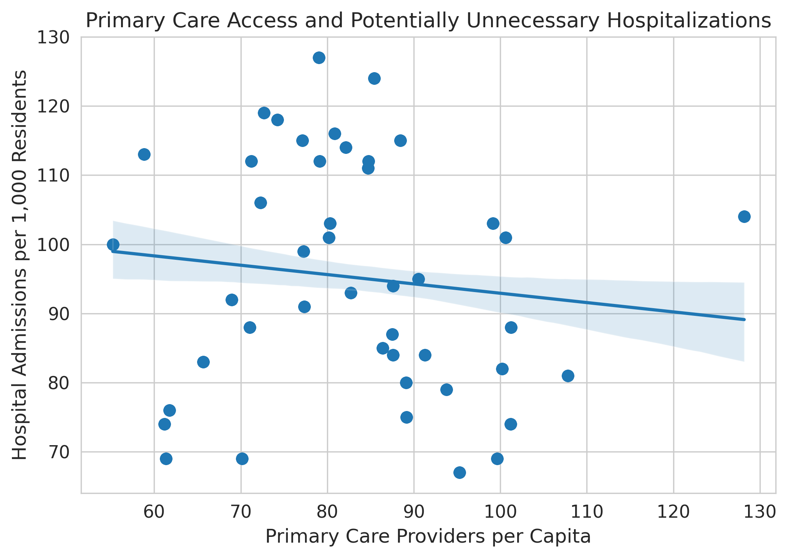
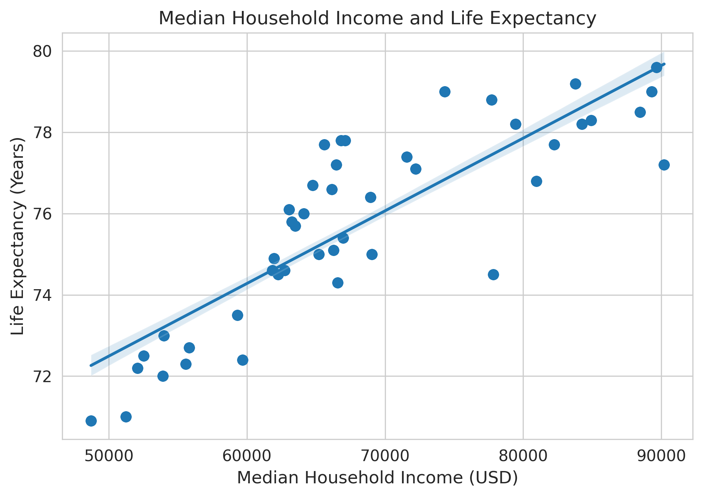
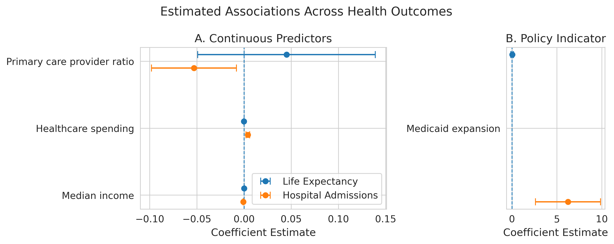

# State-Level Determinants of Health Outcomes

**A Self-Led Applied Health Policy Analysis**

## Overview

This project examines how economic conditions and healthcare system characteristics are associated with population health outcomes across U.S. states. Using state-level data, I analyze two complementary outcomes:

* **Life expectancy**, representing long-run population health
* **Hospital admissions per capita**, used as a proxy for potentially unnecessary or avoidable hospitalizations

The analysis is designed as an applied policy exercise, emphasizing clear interpretation, appropriate modeling choices, and transparent limitations rather than causal claims.

---

## Research Questions

1. How strongly are socioeconomic conditions associated with life expectancy across states?
2. Do healthcare system characteristics—particularly access to primary care—relate more closely to healthcare utilization than to mortality outcomes?
3. How do economic and policy factors differ in their associations with long-run health versus potentially avoidable hospital use?

---

## Data and Variables

The analysis uses state-level data compiled from publicly available sources.

### Outcomes

* **Life expectancy** (years)
* **Hospital admissions per capita** (per 1,000 residents), interpreted as a proxy for potentially unnecessary hospitalizations

### Key Explanatory Variables

* **Median household income** (USD)
* **Primary care provider (PCP) ratio** (providers per capita)
* **Healthcare spending** (per capita)
* **Medicaid expansion status** (binary indicator)

---

## Methodology

All models are estimated using ordinary least squares (OLS). Diagnostic testing and residual analysis indicated heteroskedasticity and correlated errors, so all results are reported with **heteroskedasticity-robust (HC3) standard errors**.

Two separate models are estimated:

1. Life expectancy model
2. Hospital admissions model

Coefficients are interpreted as conditional associations rather than causal effects.

---

## Key Findings

## Figures

### Figure 1. Primary Care Provider Density and Hospital Admissions



*Relationship between primary care provider (PCP) density and hospital admissions per 1,000 population across U.S. states. The fitted line reflects a linear association estimated using ordinary least squares with robust standard errors and state-level socioeconomic controls. Lower hospital admissions are interpreted as fewer potentially unnecessary hospitalizations.*

### Figure 2. Median Household Income and Life Expectancy



*Association between median household income and life expectancy at birth across states. Higher income levels are associated with longer life expectancy, consistent with well-documented socioeconomic gradients in health outcomes. The fitted line reflects a multivariable regression with robust inference.*

### Figure 3. Median Household Income and Hospital Admissions


*Relationship between median household income and hospital admissions per 1,000 population. States with higher incomes tend to experience lower rates of hospital admissions, suggesting fewer potentially avoidable hospitalizations in higher-resource environments.*

### Figure 4. Estimated Effects of Policy and Socioeconomic Variables on Health Outcomes



*Coefficient comparison plot summarizing estimated effects from regression models of life expectancy and hospital admissions. Points represent coefficient estimates and horizontal lines denote 95% confidence intervals based on robust standard errors. Hospital admissions are interpreted as a proxy for potentially unnecessary hospitalizations. Estimates are shown on a common scale to facilitate comparison across outcomes.*

### Life Expectancy

* **Median household income** is strongly and positively associated with life expectancy across states.
* Healthcare system variables (primary care availability, healthcare spending, Medicaid expansion) are not independently associated with life expectancy once income is controlled for.
* The life expectancy model explains a large share of cross-state variation.

**Interpretation:** Socioeconomic conditions appear to dominate long-run population health differences at the state level.

---

### Potentially Unnecessary Hospitalizations

* **Median household income** is negatively associated with hospital admissions, indicating fewer potentially avoidable hospitalizations in higher-income states.
* **Primary care provider availability** is significantly associated with lower hospital admissions, consistent with improved access to preventive and outpatient care.
* **Healthcare spending** and **Medicaid expansion** are positively associated with hospital admissions, likely reflecting increased utilization and access rather than worse health.

**Interpretation:** Healthcare system structure—particularly access to primary care—plays a larger role in shaping utilization patterns than in determining mortality outcomes.

---

## Visualizations

The project includes four primary figures:

1. **Primary care provider ratio vs. hospital admissions**
2. **Median income vs. life expectancy**
3. **Median income vs. hospital admissions**
4. **Two-panel coefficient plot** comparing estimated associations across outcomes

The coefficient plot separates continuous predictors from the Medicaid expansion indicator to avoid scale distortion and improve interpretability.

---

## Limitations

Several limitations should be considered:

* Hospital admissions are an imperfect proxy for unnecessary hospitalizations; some admissions may reflect appropriate or improved access to care.
* The analysis relies on cross-sectional, state-level data, limiting causal inference and obscuring within-state variation.
* Key variables such as income, provider supply, and spending are likely endogenous and jointly determined with health outcomes.
* Correlated predictors and scale differences may reduce precision for some coefficient estimates.

Despite these limitations, the analysis provides useful insight into how economic conditions and healthcare system characteristics are differently associated with health outcomes and healthcare utilization.

---

## Takeaways

* Economic conditions are central to long-run population health.
* Primary care access plays a critical role in reducing potentially avoidable hospitalizations.
* Policies aimed at improving health outcomes may differ from those aimed at reducing inefficient healthcare utilization.

---

## Tools and Skills Demonstrated

* Applied regression analysis (OLS with robust standard errors)
* Diagnostic testing and model validation
* Policy-oriented interpretation of statistical results
* Data visualization for applied research
* Clear communication of limitations and non-causal findings

---

## Repository Structure

```
├── data/              # Cleaned datasets
├── notebooks/         # Analysis and visualization notebooks
├── figures/           # Final plots used in the report
├── README.md          # Project overview (this file)
```

---

## Contact

This project was completed as a self-directed analysis. Questions or feedback are welcome.
